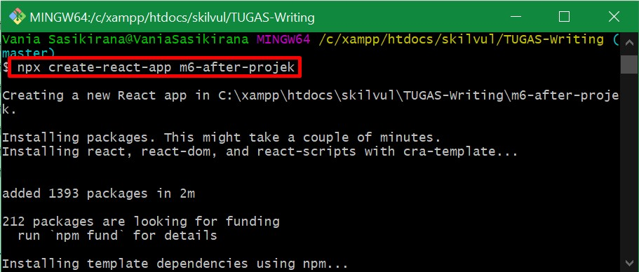
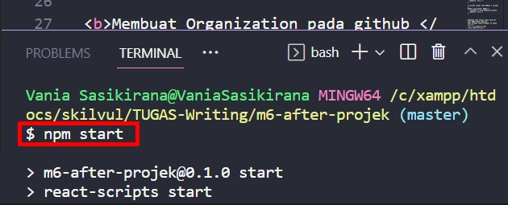
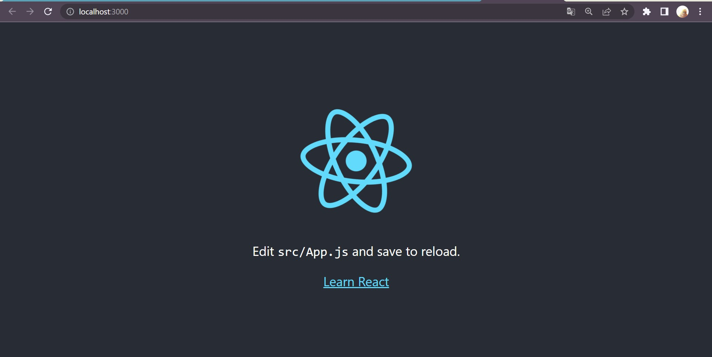
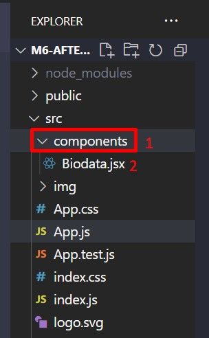
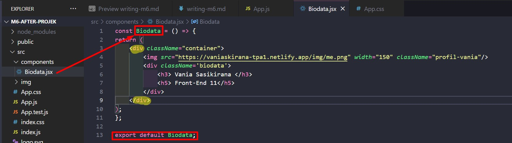
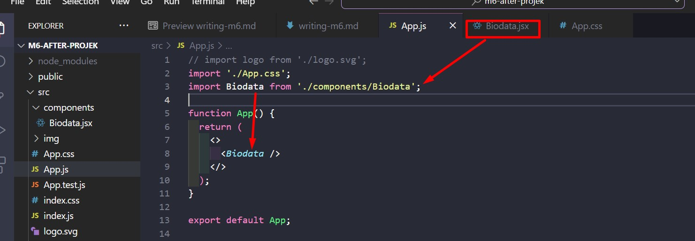
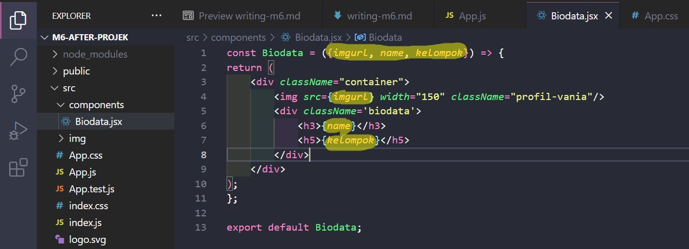
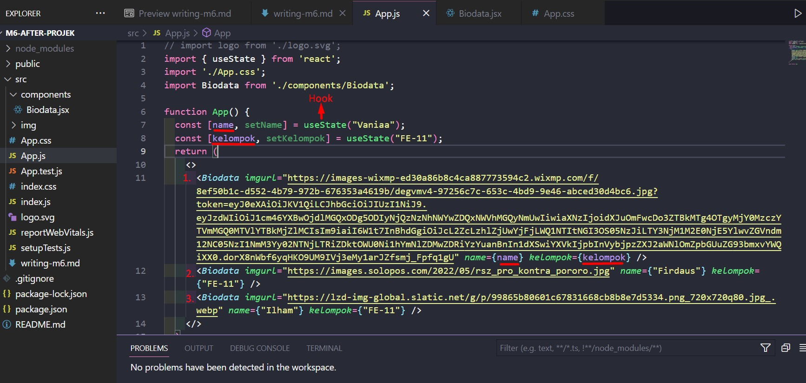

# Writing and Presentation Test Week 6 [24 okt s/d 28 okt]
## <h4>Nama     : Vania Sasikirana</h4><h4></h4>Group FE 2 - Kelompok 11</h4> <h4>Mentor : Thoriq Nur Faizal</h4>

<br>
<br>

### **1. React Dasar**

<br><b>React Adalah</b><hr>
  
Sebuah library Javascript yang dapat menghandle beberapa data dan library ini sangat berguna bagi Front-end karena proses pembuatan aplikasi akan menjadi lebih cepat.<br><br>

<b>Menjalankan Aplikasi React.js</b><hr><br>
Untuk dapat menjalankan aplikasi <b>React.js</b> ini kita harus melakukan instalasi reactterlebih dahulu pada folder kita.<br><br><b>Instalasi React : </b><br>
```
    1. Masuk ke dalam folder tujuan yang ingin di-instal React terlebih dahulu.
    2. Buka folder tersebut di dalam Git, dengan cara klik kanan pada area folder kosong kemudian pilih " Git Bash "
    3. Ketikkan perintah "npx create-react-app namafolderkalian"
```

<br><br>
Kemudian untuk menjalankkannya bisa menggunakan perintah "npm start".

<br><br>


<br><br>

<b>Component</b><hr><br>
Pada React ini kita dapat membuat sebuah component, hal ini dilakukan agar data di dalam folder React terlihat lebih rapih dan terstruktur.<br><br>
Fungsi dari Components ini sendiri digunakan untuk mengirim data yang berupa function, class, dan lainnya agar dapat digunakan atau dipanggil oleh App.js<br><br>

<b>Cara membuat Components</b><hr><br>

```
1. Buatlah folder bernama "components" terlebih dahulu di dalam folder src
2. Kemudian buatlah file bernama component yang ingin dibuat, misalnya Biodata. Maka tulislah
Biodata.jsx
```


```
3. Setelah itu kita gunakan Arrow untuk membuat component Biodata
```


#CATATAN : Pada components perhatikan 4 hal berikut : 
1. Penamaan file Component harus menggunakan huruf besar.
2. Pemberian nama function harus sama persis dengan nama file component itu sendiri.
3. Bungkus codingan HTML menggunakan 1 tag div parents atau fragment tag <></>.
4. Jangan lupa setelah semuanya selesai lakukanlah eksport, agar file Components itu sendiri
dapat dipanggil di dalam file App.js



```
4. Terakhir jangan lupa kita panggil/import components kita ke dalam App.js dan kita panggil di dalam return.
```
<br><br><br>


<b>Props dan State</b><hr><br>
Kita dapat mengubah data react menjadi dinamis, jadi tampilan kontennya beda2 even kita duplikasi sebelumnya, nah ini tergantung dari 2 hal di bawah ini :<br>

<b>Props </b> Merupakan jalur komunikasi antara parents dan child, App si induknya, componentsFile.jsx si child nya. <br>
<b>State</b> Merupakan sebuah object untuk menyimpan data di react, kemudian di render saat ingin melakukan perubahan data. Sementara Props itu untuk berkomunikasi pengiriman data antara parents dan child, props singkatan dari properties mirip di function.<br>

<b>Perbedaan Class Component dan Functional Component</b><<br>
Pada Class Component kita dapat menggunakan props dan juga state, namun pada Functional Component
kita hanya dapat menggunakan props saja. Maka dari itu Functional Component ini disebut sebagai
Stateless.

#CATATAN Istilah di dalam props dan state :
1. Stateless : Tidak memiliki state, jadi hanya ada props saja ( jadi gada data yang disimpan, datanya pure dari props saja ).
2. Statful : Memiliki state, dan dapat mengirim state ke komponen.
<br><br>

Contoh State dan Props :<br>
<br>

Pada gambar di atas baris pertama terdapat props yang menyimpan state imgurl, nama, dan kelompok.<br><br>
Kemudian kita panggil dan deklarasikan nilai di file App.js<br>
<br>


